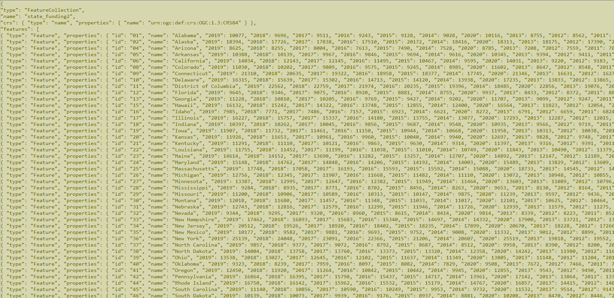

# Final Project Proposal BB4

**-Aidan James Coffman, Liam Johnson, Baldemar Zamudio, Efren Ramirez**

## Summary
Broadly, this project is intended to demonstrate our ability to synthesize skills and concepts learned in this class with new data. We are also meant to demonstrate our ability to select a topic and collect data to be used in an effective and clear way. Documenting that process and overcoming the hurdles shows our web mapping capabilities. The project was also meant to strengthen our ability to work with other people in our field that have varying skill sets and experience. We used GitHub’s repositories feature to share our files and collaborate on different aspects of the project. This allowed us to test our website and stay in touch about project progress.

The topic we chose for this project is the United States Education System. It is a topic we are all passionate and curious about, so the data collection process was enjoyable and interesting. There are many ways we could go about visualizing educational quality. After some brainstorming we settled on an interactive choropleth map that shows state data about educational spending. This narrowed down what data to search for but still left many paths to investigate. Many different spending metrics can be used, such as federal and state education budgets or the amount spent on each student. 

The metric we settled on to visualize this was state spending per pupil. Some states have larger numbers of students and so even if they have a larger budget allocated overall, it might not mean that the quality of the education is higher since it is split between a larger population of students. The ‘per student spending’ metric adjusts for this in a way that is simple and easily digestible for audiences viewing the map at a glance, but also holds up under scrutiny even after being heavily considered. This metric was available from a consistent source for the period of 2002-2020. As with any metric that people use to assess education quality it is not without its downsides. Higher dollar amounts spent per student often could have diminishing returns or can be unnecessary in specific situations. Even with that in mind we decided it was still a worthy variable to track even if on its own it doesn’t establish a complete picture of a state’s educational quality. 

The amount spent on each student is a value calculated by the United States Census Bureau. They collected data from each state regarding the amount they spent on various aspects of education per student. These aspects include salaries and employee benefits for instructors and also the amount spent on support services like administration and school programs. We were glad to find a strong source like the Census Bureau that has large libraries of trustworthy data available in usable formats.

We were able to reformat their information on State ‘per student spending’ into a geojson file to be used with the Mapbox web mapping API to create an interactive map. Users can play with the intuitive slider feature to glean an understanding of how much states spend on their students. Before they use the slider, it defaults to a position where it shows the average value that each state spent per pupil over the course of 2002-2020. This view allows the user to get the most “at a glance” information as possible, where they don’t even need to use the slider feature necessarily to understand the message we are delivering. However, a user that is willing to spend some time playing with the slider and hovering over each state will be able to learn much more about the trends at play. 

To create the data for our web map, we first compiled the ‘Total’ columns from page 8 of the State-Level Tables .xls file from the 19 US Census Bureau Links. After we had those compiled in Google Sheets we removed the junk data like blank lines and added an average column to display the average value of all the years for each state. We also converted the dollar amounts to integers and removed the dollar sign from each value. Lastly we exported it as a .csv file to be imported into QGIS. We used geojson.io’s tool to delete the density property of the state_data.geojson file available in Lab04 from the class GitHub. We imported the state_data.geojson and state_funding.csv file into QGIS and joined them using the state names. We then exported the file as state_funding.geojson to be used with the Mapbox API.

To code our website, we began by mapping out what resources we could repurpose from lab 04 and the Mapbox time slider documentation. We patched it together first getting the initial map layer functioning. Then we worked on a feature where the slider would replace the added layer with a new layer to display data that matches the year the user has selected. In addition to creating a functional website we adjusted some cosmetic features like the colors used in the map and legend as well as creating a customized style on the Mapbox website to be called in the code. We are very happy with our final product! If we were to continue this project in the future, we might add a toggle to switch the data displayed to be educational outcome measurements like test scores. This would provide an even more complete picture of the state of the US Education system, as it would show whether increased spending correlated with better outcomes.

## Goal
As parents are prioritizing education for their children, there is a higher attendance rate and demand for a high quality learning environment. In an effort to provide helpful information about education we have decided to investigate state spending on education per student in the United States as a way to effectively visualize how much is being invested across the country in education. We want to look and see which states invest more resources into the education of the students.

The target audience for this project is parents and students who are looking for a state where they would be given the most resources for their education. We also want to appeal to people who are simply interested in learning more about the topic like we were but don’t have the time to explore and compile pages of data from the US Census Bureau.

We made a choropleth map that shows the spending data for Public Elementary - Secondary Education using an understandable color scale. We implemented an interactive time slider on our map for users to select different years and see the state spending data available for the chosen year.

## Links
- [Map Webpage](https://aidancoffman.github.io/BB4FP/state_spending_edu.html)

- [Map Repository](https://github.com/AidanCoffman/BB4FP)

## Screenshots
![This is a Screenshot of the Webmap Available by Visiting our website. It portrays a choropleth map of the United States shaded on a scale where redder states are spending less per student, whiter states are spending an average amount, and greener states are paying more per student. In the top left corner is a description of the map with basic instruction on using the slider to view different years. In the bottom Corner is a Legend explaining the spending ranges captured by each shade of red to white to green.](img/Webpage.png)

## Main Functions
Our site uses a slider function to filter the data by year, the user could select the year they would like to view and the website will dynamically change to show the filtered data. In order for the data to load the slider function runs every time the slider value is changed. The legend allows users to see the category of income each state invested in education for the filtered year. The user could see which year they are currently viewing on the main panel.

## Data Sources
- The [US Census Bureau’s website](https://www.census.gov/data/tables/2002/econ/school-finances/secondary-education-finance.html) provided us our data available on slide 8 of the “State-Level Tables” .xls file.

- We changed the [year in the URL](https://www.census.gov/data/tables/2020/econ/school-finances/secondary-education-finance.html) to get data for each year within our range of 2002-2020

- We adapted features demonstrated in [this documentation](https://docs.mapbox.com/help/tutorials/show-changes-over-time/) from Mapbox

- We adapted features demonstrated in [Lab 04](https://github.com/jakobzhao/geog495/tree/main/labs/lab04) from our course

- Here is a [Google Sheet file](https://docs.google.com/spreadsheets/d/1lBYiYO1YMh1NZWl4PDbXTaK5JXZINErlXzaeg6Aabfs/edit?usp=sharing) we used to test various features on our data and compile the .csv to combine into our geojson with QGIS’s join and export features

## Applied Libraries
- Mapbox GL JS
- GitHub

## Acknowledgements
- Special thanks to Lisette for helping sort out and explain some confusing code.
- QGIS allowed us to save a lot of time by combining our data .csv with our .geojson
- geojson.io helped us visualize changes to our .geojson file and verify that it was still functional.
- [OpenAI's Chat demo](https://chat.openai.com/chat) for resolving a simple JS challenge that we spent an hour trying to solve on our own.
- Mapbox documentation was extremely helpful in understanding some of the features we wanted to implement.
- Professor Zhao and TA Steven Bao have been very accomodating toward our issues with time constraints and when one of our members was sick.
- Discord allowerd us to arrange meetings remotely and provided quick communication about the project.
